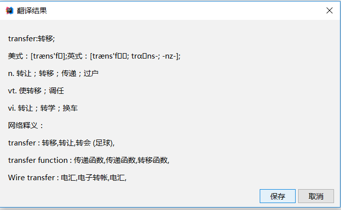
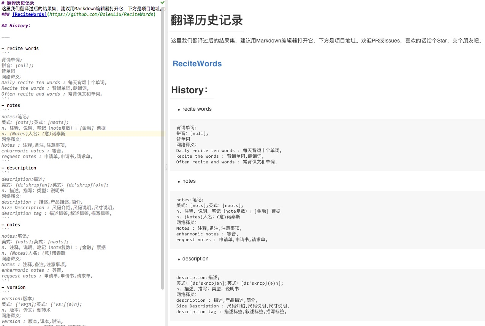
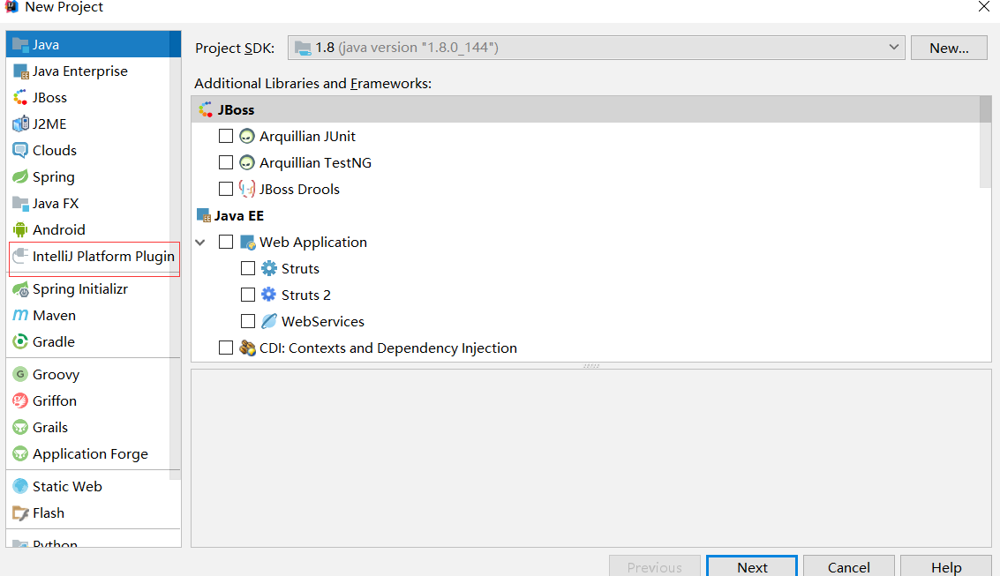
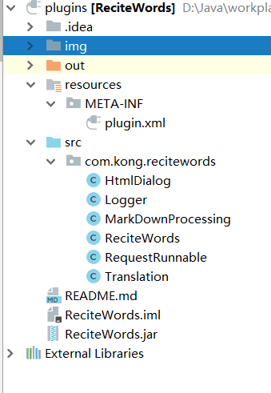
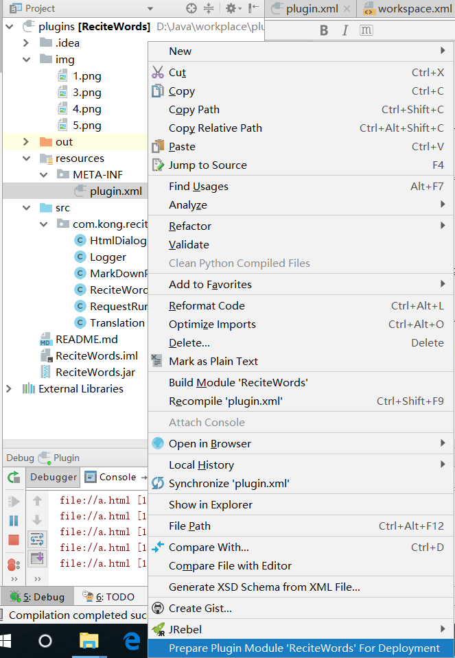

# ReciteWords

 Fork https://github.com/BolexLiu/ReciteWords

## 新增功能
- 以弹窗的形式呈现翻译结果

## 使用方法

- Clone项目，获取根目录下的ReciteWords.jar。

- 打开Android Studio， Preferences -> Plugins -> Install plugin from disk -> 获取ReciteWords.jar安装并重启Android Studio。

- 选中代码，按下 Alt+Q(也可以自己设定)。即可翻译。效果如下:

  
- 翻译的单词会被记录在**当前项目的根目录**下的翻译历史记录.md文件中（如:\xxxProject\翻译历史记录.md）。可以通过Markdown打开它。as翻译后切换Project模式可以在项目文件夹中直接看到。效果如下:

  

## 修改快捷键

### 使用键盘快捷键触发
- Preferences -> Keymap -> 获取ReciteWords - > 右键 add Keyboard Shortcut. 输入你想要的快捷键即可。

## 插件开发流程
- 1 安装插件 “Plugin Devkit”,Setting -> Plugins -> Search ,安装后重启即可

- 2 安装完毕后，创建项目，发现多了以下红框内容
      
 
- 3 将项目代码copy过去新建的项目即可，如图 
      
     

- 4 调试插件，像普通的Java窗体程序开发即可，调试的时候会打开一个新的idea

- 5 插件发布，右键点击plugin.xml，选择如图所示，即可发布插件（打包插件）      
         

## 参考资料
    
   http://www.jetbrains.org/intellij/sdk/docs/user_interface_components/dialog_wrapper.html
   
    
